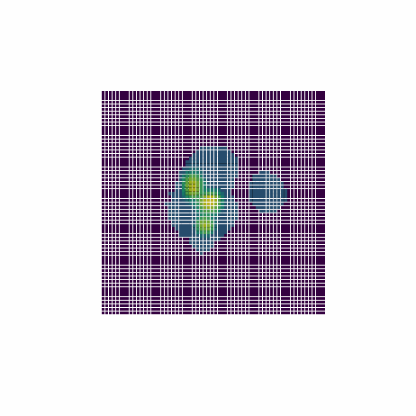
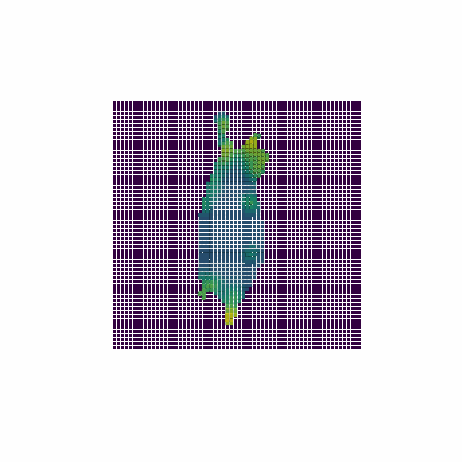
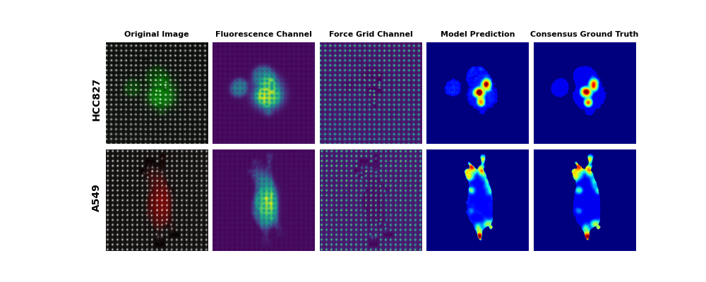

# FICM: Force Informed Cell Map 

FICM: Force Informed Cell Map Image Synthesis using Attention-gated Dual Encoder U-Net for Carcinoma Cell Line Classification    

  
  

  

- Carcinoma Cell Line Classification Problem:
  HCC827 & A549 are two types of lungadenocarcinomacell lines that display different aggressiveness behaviors. Though they can be separated via staining, different staining methods may influence their actual behaviors. Furthermore, cellularmorphology can be completely stochastic, making it very challenging and highly subjective to separate themvia fluorescence signals using the naked eye.
- Classification via Force Map:
  It is known that A549 exhibits more movement on the substrate than HCC827. Therefore, the two types are hypothesized to have different force distribution patterns which can be turned into visible signals by culturing themon force-sensing chips. Force-sensing chips are synthesized substrate with micropillars spanning across the sensor chip for cells to grid onto. When a cell exerts force onto the micropillars, displacements can be detected via reflect signals and converted into gradient forcemaps. However, gradient maps lack spatial information to single out individual cells.
- Force Informed Cell Map:
  To address these issues, we propose a new modality that combines both information from a target cell’s morphology and its internal force map synthesized completely based on deeplearning with an attention gated dual encoder U-Net with SE-Fusion module model architecture. The proposedmodality possesses a clear boundarymask alongwith force gradients inside themask that represents the force patterns of a cell.
