# FICM: Force Informed Cell Map 
FICM: Force Informed Cell Map Image Synthesis using Attention-gated Dual Encoder U-Net for Carcinoma Cell Line Classification    

- **Carcinoma Cell Line Classification Problem**: **HCC827** & **A549** are two types of lungadenocarcinomacell lines that display different aggressiveness behaviors. Though they can be separated via staining, different staining methods may influence their actual behaviors. Furthermore, cellular morphology can be completely stochastic, **making it very challenging and highly subjective to separate them via fluorescence signals using the naked eye.**
- **Our Hypothesis**: We find A549 cells exert more movements than HCC827 cells under the microscope. Therefore, we hypothesize that A549 cells has a different force pattern than 
- In our research, we propose a **new medical image modality that combined a cell's morphological feature with its internal force gradients captured with force-sensing chips**. Our proposed modality is able to enhance classification accuracy by 37.67% compared to unprocessed modalities.

See the **[full Poster here](./assets_ficm/RCAS_summer_intern_seminar_poster_kailinchen.pdf)** for more dataset description and results analyses.

  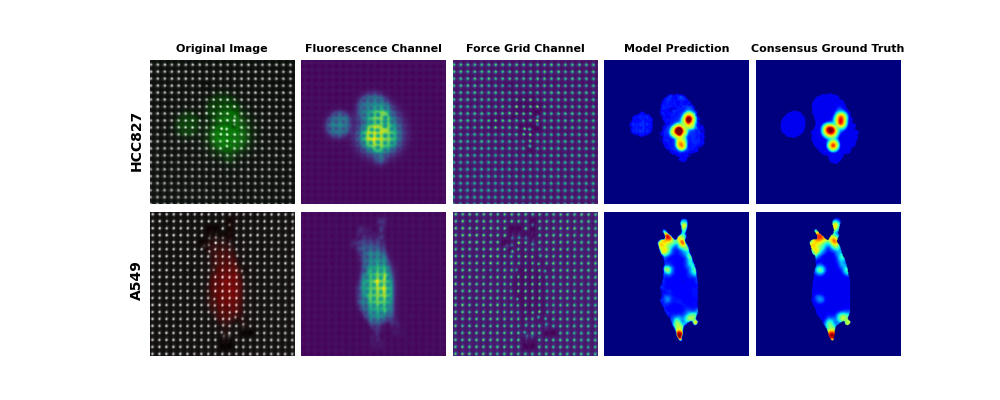
   
  <b>Figure 1.</b> Montage of our proposed modality compared with original modalities.

  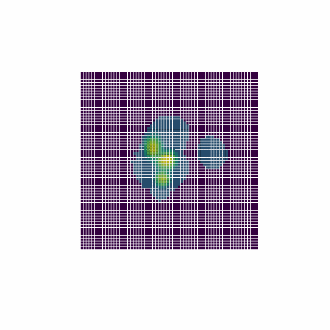
  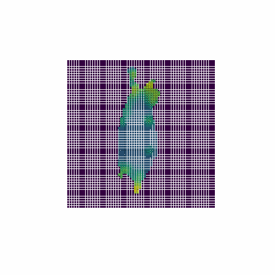
   
  <b>Figure 2.</b> 3D video of our designed modality.

## Modality Design: 
The proposed fusion modality combines two major features of a cell, the boundary feature and its internal force gradient. (See **Figure 3.**)

  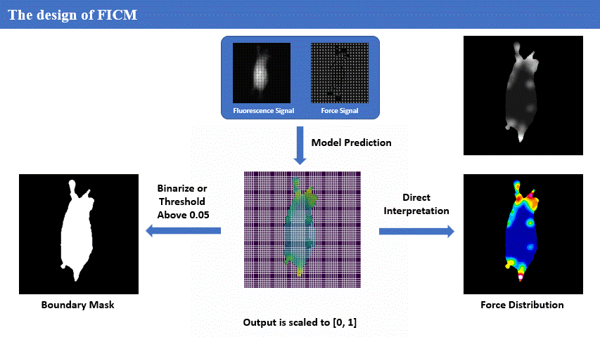
   
  <b>Figure 3.</b> Overview of the proposed model architecture.

Our training method allowed complementary modality fusion, which would **use both features from fluorecence signals and its force gradient to decide** the most accurate cell boundary while revealing its instantaneous internal force gradients. (See **Figure 4.** and **Figure 5.**)
<table align="center">
  <tr>
    <td align="center">
      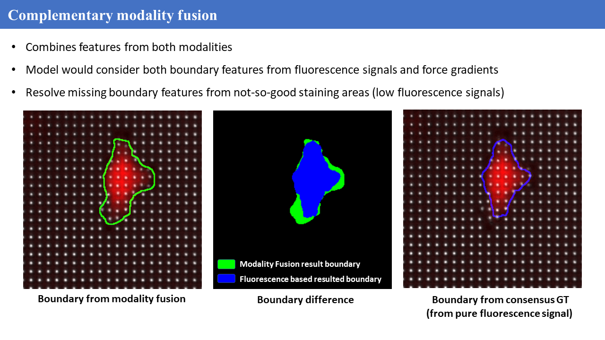 
      <b>Figure 4.</b> Case when lacking fluorescence signal.
    </td>
    <td align="center">
      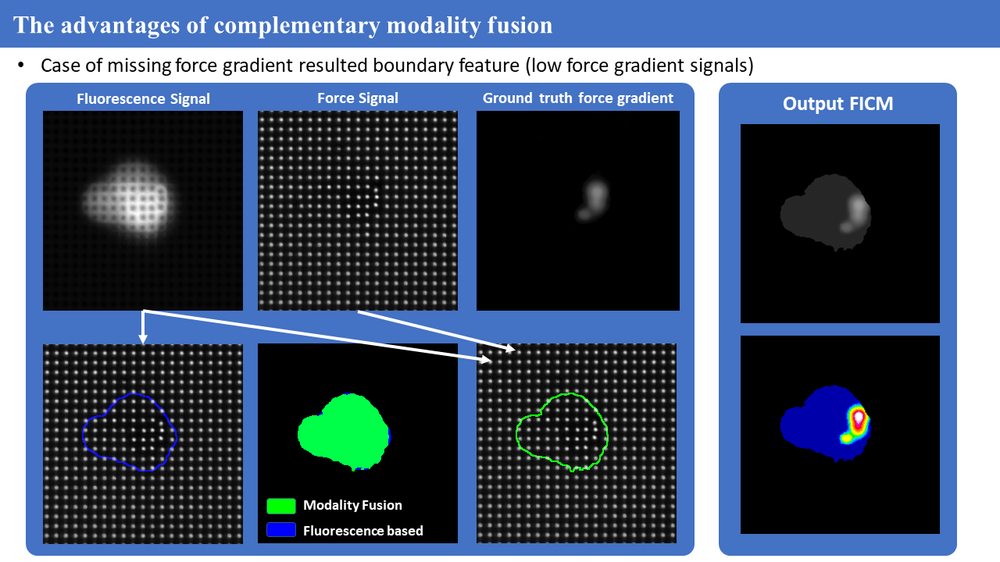 
      <b>Figure 5.</b> Case when lacking force gradient signals.
    </td>
  </tr>
</table>

## Modality fusion Model Architecture:
Our model architecture is inspired by [MRI-Styled PET](https://ieeexplore.ieee.org/document/10918787). We adpoted a dual-encoder structure to extract features from both fluorescence signals and force gradient signals. We added a Squeeze-and-Excitation Module at the bottleneck to adapt the fusion weights channel-by-channel. Our loss function consists of equal weights of dice loss and masked smooth L1 loss (only consider the accumulated loss within the boundary). 

  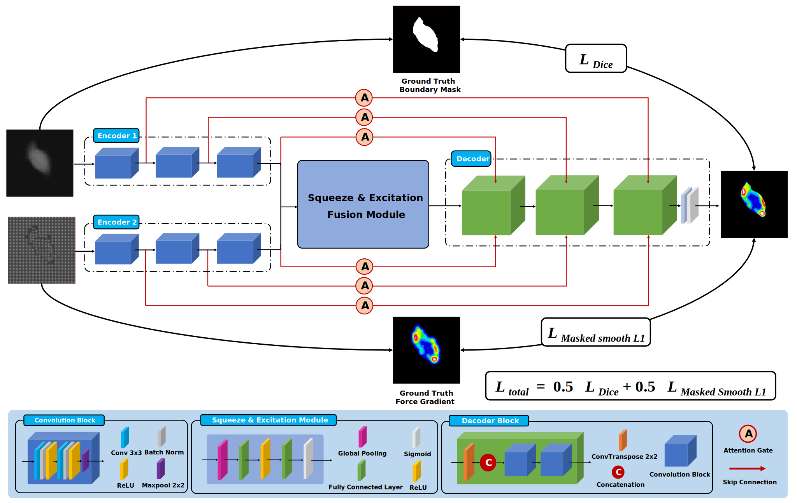
   
  <b>Figure 6.</b> Overview of the proposed dual-encoder modlaity fusion model architecture.

## Classification model architecture and classification results:
We used a simple 4-layer CNN model for this classification task.

  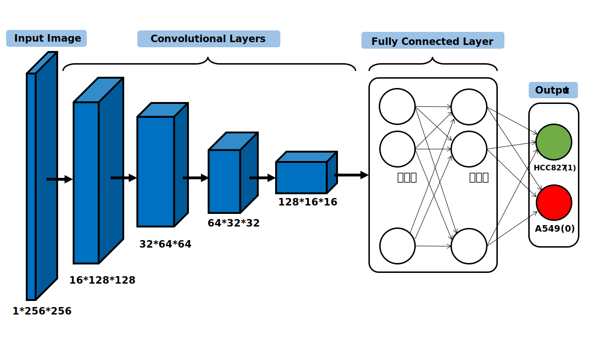
   
  <b>Figure 7.</b> Overview of our classification model architecture.

**Figure 8~11** are confusion matrices of different modalitites using the same test dataset.
<table align="center">
  <tr>
    <td align="center">
      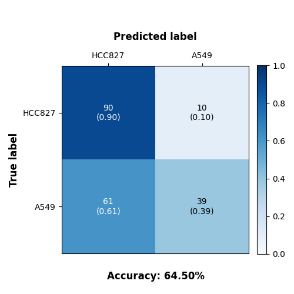 
      <b>Figure 8.</b> Pure fluorescence images
    </td>
    <td align="center">
      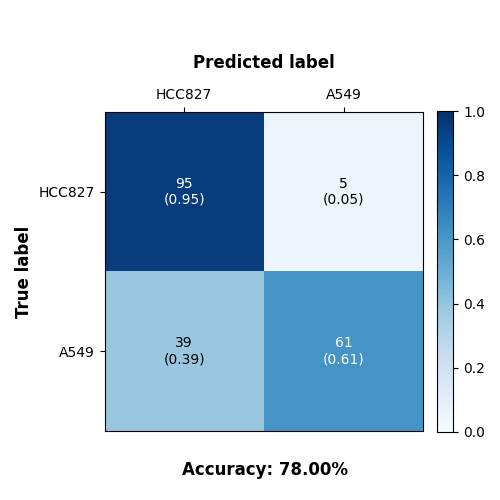 
      <b>Figure 9.</b> Pure force grid images
    </td>
    <td align="center">
      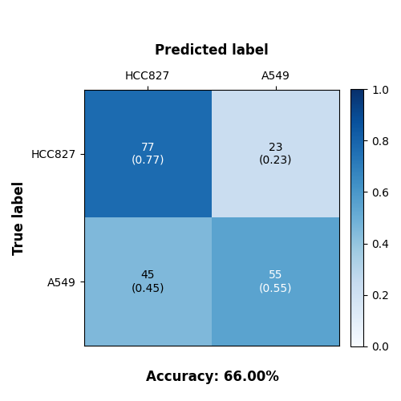 
      <b>Figure 10.</b> Stacked fluorescence and force grid
    </td>
    <td align="center">
      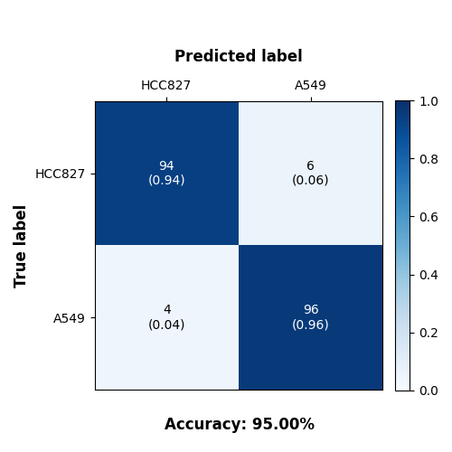 
      <b>Figure 11.</b> Our proposed fusion modality.
    </td>
  </tr>
</table>

## Conclusions:
- We developed a new deep learning-based medical image modality for cell mechanobiology studies.
- Our proposed dual modality fusion network generates images with high structural similarity (average≈0.9693) and high overlap with the consensus groundtruths.
- Enhances classification accuracy by 37.67% compared to unprocessed modalities.
- Mechanical force pattern provide discriminative features to classify A549 and HCC827 cell lines.
- Hypothesis validation: Many A549 cells exerts force on endpoints for linear movement, while HCC827 cells show scattered focal adhesions for anchoring. (See Figure Below)

  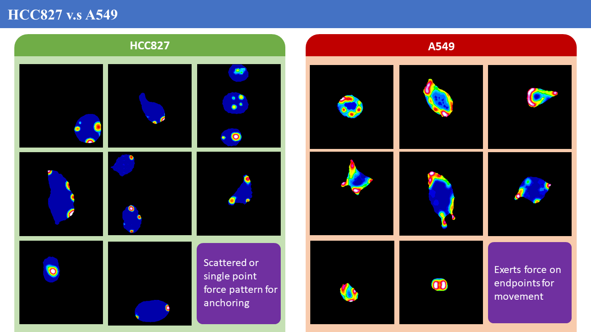
   

